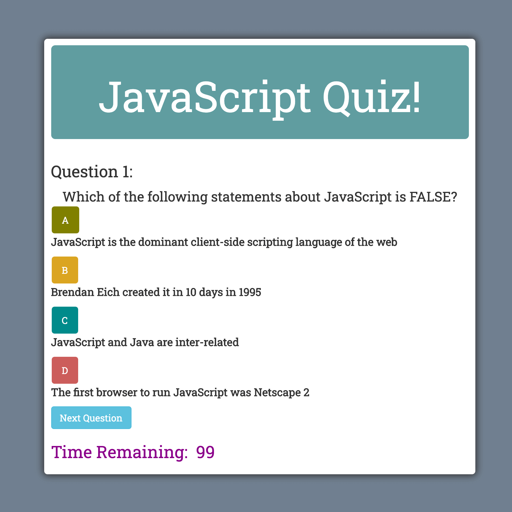

# Quiz

## Description
  This a timed, multiple-choice JavaScript quiz that I wrote. Simply open the live site and let the fun begin!  Make sure your sound is on. You get 15 seconds to answer each question. The quiz has a countdown timer with time penalties for incorrect answers, utilizes local storage and lets you enter and save your initials for the Highscores/Scoreboard.
  
  The quiz app uses many hide and show elements for different screens, event clicks, local storage, hover buttons, functions, loops, conditionals, validations, array and string manipulation methods, Bootstrap, Google fonts, jQuery, timer elements, along with fun sounds! The JavaScript dynamically updates and renders the HTML and CSS. It is mobile-responsive and fun. Enjoy!

[Link to project](https://erin-smith.github.io/Quiz/)
  

## Table of Contents
* [Installation](#Installation)
* [Usage](#Usage)
* [License](#License)
* [Contributing](#Contributing)
* [Tests](#Tests)
* [Questions](#Questions)
 
 
## Installation 
  Open the link and have fun!
  
## Usage 
  This quiz is fun and challenging and I would like to update this as I learn more JavaScript!

## License 

  This project is licensed under the ISC license. 

## Contributing   
 If you would like to contribute to this project or have feedback, please contact me below in the Questions Section.
***
 **Contributors:** erin-smith   
***

 

## Tests 
  I tested this project using Chrome debugger, inspect, throwing errors, and console.logs

## Questions:  
  

  If you have any questions about the repo, [open an issue](https://github.com/erin-smith/Quiz/issues/new) or contact me:  

* [My GitHub Profile](http://github.com/erin-smith)
* 
***
